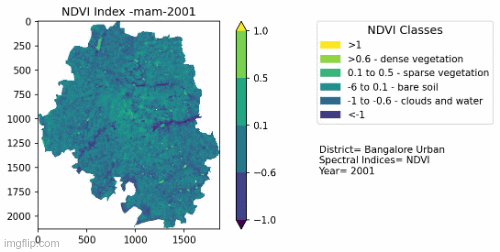
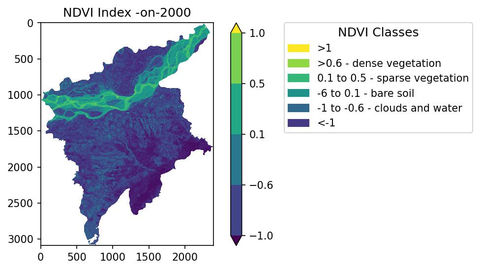

# Spectral Indices Analysis using geospatial frameworks

This repository contains the automation pipeline for analysis of various spectral indices over a given time frame using geemap and earth engine api. 


## Various Spectral Indices 
We have implemented the following indices and included the code snippets for the following:

__NDVI__ 🌲🌲

NDVI or Normalized Difference Vegetation Index determines the normalized difference between near-infrared (which vegetation strongly reflects) and red light (which vegetation absorbs). The value ranges from -1 to 1. When the value is _negative_, it is highly likely that it is water. If the value is close to _zero_, it might be an urbanized area or an area with no green leaves. If the value is _positive_, then it has a possibility of dense green leaves.


__NDBI__ 🏢🏢

NDBI or Normalized Built-up Index determines the normalized difference between the short wave infrared light and near-infrared light. The value ranges from -1 to 1. Negative NDBI vales represent water bodies and higher values represent built-up areas.

__MNDWI__ 🌊🌊

MNDWI or Modified Normalized Difference Water Index determines normalized difference between the green and the short wave infrared light to enhance the open water features. The value ranges from -1 to 1, where the negative values indicates no vegetation or water content and the positive values indicates water content.

## Library Installations 👩‍💻

1. Sign up in the [Google Earth Engine](https://earthengine.google.com/).
2. It is always advised to create a conda environment to install all the earth engine related dependencies. Hence install [Anaconda](https://www.anaconda.com/products/distribution#download-section) or [Miniconda](https://docs.conda.io/en/latest/miniconda.html)  on your computer.
3. Create a conda environment with a name say, gee.YOu may choose not to specify the python version.
```bash
conda create -n gee python=3.9
```
4. Activate the conda environment.
```bash
conda activate gee
```
5. Install the following packages.
```
conda install -c conda-forge geemap
conda install -c conda-forge earthengine-api
pip install PyDrive
pip install rasterio
```

6. You are good to go. Now you can execute aall the code in the current repository.

## Example Unit Tests 📚
*A beginners guide*

Several *Unit Test* scripts are also available for future experiments. All the unit tests are provided in the notebook (.ipynb) format and can be directly executed at the users end using jupyter notebook.

This will also serve as a guide for people who are just getting started working with earth engine and geemap and want to understand and explore this work. This code snippets are tests done before compiling the final workflow.


1. [Downloading a range of images (by date)](unit-tests-notebooks/downloading-a-range-of-images-by-date.ipynb).
2. [Clipping the Image Collection to the shapefile](unit-tests-notebooks/clipping-an-image-collection-to-the-shapefile.ipynb).
3. [Download 2001 data season wise](unit_tests_notebooks/download-seasonwise-data-for-a-year.ipynb).
4. [Check the mean image of a image collection](unit_tests_notebooks/mean-image-for-a-image-collection.ipynb)
5. [Check NDVI index compute for any time interval](unit-tests-notebooks/ndvi-index-compute-for-a-year.ipynb)
6. [Download a computed image in a self set palette](unit-tests-notebooks/download-in-a-self-set-palette.ipynb)
7. [Converting a GEOtiff file to a labelled map in any format](unit-tests-notebooks/converting-a-GEOtiff-file-to-a-labelled-map-in-any-format.ipynb)


## Workflow of the project 🔄

This project has two workflows:
1. It prepared as a series of .ipynb notebooks, which needs to executed in the sequence described below.

    **[Script 1 - Custom Parameter Initialization](notebook_scripts/custom-parameter-initialization.ipynb)**


    1. Take custom input from users i.e. target years, target spectral indices[TODO], target cities. 
    2. Get the shapefiles for each target city and put it in a hash table for mapping.
    3. You can find the _city name list_ for the FAU GAUL 500m dataset [here](notebook_scripts/Get%20the%20FAO%20GAUL%20city%20names.ipynb.)
    4. Dataset for shapefiles - [FAO GAUL 500m](https://developers.google.com/earth-engine/datasets/catalog/FAO_GAUL_SIMPLIFIED_500m_2015_level2#table-schema) 
    5. You can also use a local shapefiles instead of the online dataset. The code for including local shape files in the project can be found by uncommenting the `local_shp()` in [this](notebook_scripts/custom-parameter-initialization.ipynb) notebook.
    6. A script is also created to extract polygon shapefiles given the latitude and longitude data of a region. You can find the example notebook [here](notebook_scripts/getting-the-shapefiles.ipynb). You can also refer to Script 5 of this section.

    **[Script 2 -Create custom Spectral Index Computation and generate GEOtiff files](notebook_scripts/ndvi-computation-and-GEOtiff-file-create.ipynb)**
    1. Get the custom inputs from the previous script.
    2.	Use satellite archive (Landsat 7) dataset for the defined geometry (specific city shapefile we obtained from the previous script). 
    3.	Loop over the shapefiles of the target cities (main function) for the spectral index computation.
    4.	Get the filtered the data ( four seasons + one annual interval) specifying the date figures for a particular interval. This inverval dates will be fixed for the all the target years of study.
    5.  Get the seasonal mean and the annual mean image for a year. Thus, each year will have four resultant images. We have considered four seasons in a year.
    6. Calculate the spectral indices per year for each intervals.
    10.	A method which downloads per year images in sorted folder in the authenticated google drive.

    - **Output** :  Generates GEOtiff files per city specified. The script downloads the ndvi geotiff  maps per city and specific city folders in our drive.
    - **Dataset used** : [USGS Landsat 7 Collection 2 Tier 1 TOA Reflectance](https://developers.google.com/earth-engine/datasets/catalog/LANDSAT_LE07_C02_T1_TOA?hl=en).
    - **Frameworks Used** : geemap and GEE Python API


    **[Script 3 - Download from Google Drive to the local machine](notebook_scripts/download_script_github.ipynb)**
    1.	Download the google drive files in proper custom folder sequence in your local machine. (It requires the user to store google drive credentials which is not safe to publish or share, hence this downloading script.)
    2. You will be required to do a Google Services API OAuth Authentication to authenticate your drive. Link for the same is given in the notebook.

    - **Output** = Downloads the required files from google drive in local folder in a specified folder system.

    **[Script 4 - Create visualization maps in jpeg format from the given GEOtiff files](notebook_scripts/automating-map-generation-from-tiff-files.ipynb)**      
    1.	Create maps using rasterio and matplotlib (with proper legends and markings).
    2.	Download the maps in jpg in city wise folder.

    - **Output** : Generates jpg maps for each GEOtiff files specified and stores it in our local machine folderwise.

    

    **[Script 5 - Create shapefiles locally from local coordinate information](notebook_scripts/getting-the-shapefiles.ipynb)**  
    1. Take coordinate information for 166 Indian cities and generate a polygonal shapefile with fixed size.
    2. Save the save files in the local machine city wise.

    - **Output** : Generates polygonal shapefile folders for each centre coordinate information specified and store it in our local machine folderwise.


2. This project also has a local python script based workflow for you to run the code locally. You can refer to [local scripts](local_scripts/README.md) for the required setup. The design and working of the code are similar to the notebook pipeline and can be referred from the previous explanation for the notebook files.


